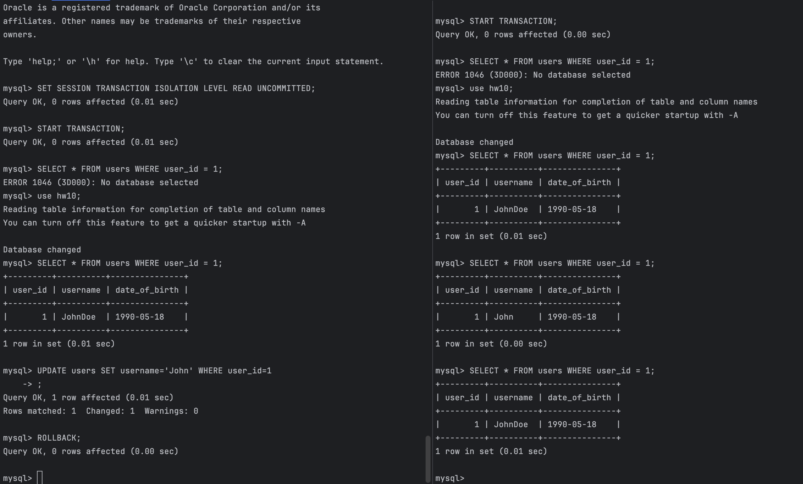

# HSA10   10. Transactions, Isolations, Locks

# Homework 10

# Lost Update
# Percona:

# Postgres:

---

# Dirty Read
# Percona:

# Postgres:
In PostgreSQL, it doesn't happen on any isolation level.

---

# Non-Repeatable Read
# Percona:

# Postgres:

---

# Phantom
# Percona:

P# ostgres:
